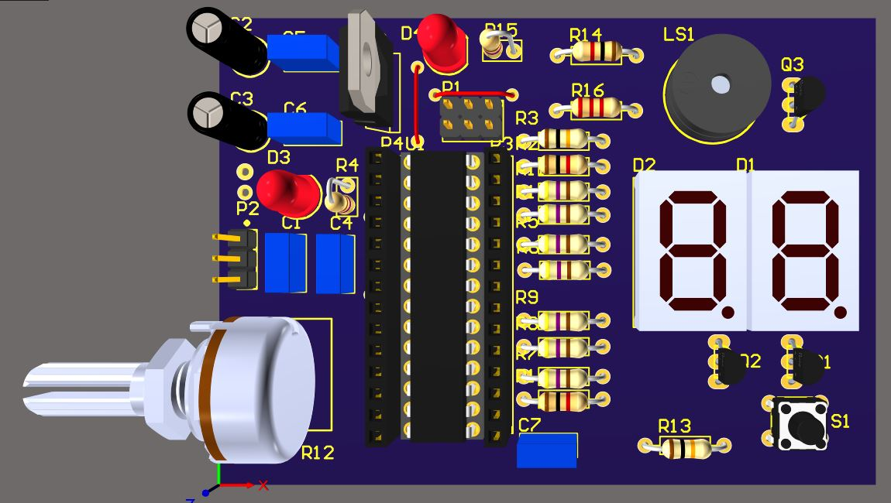
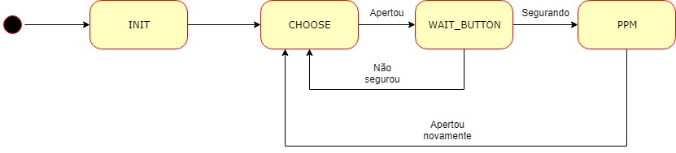

# ESC Tester

Repositório do projeto de uma ESC Tester, feito para o processo seletivo da equipe de robótica ThundeRatz de 2019.

# Placa

A placa possui:
- dois displays 7 segmentos para mostrar a porcentagem da ppm mandada para a ESC e também o modo escolhido;
- botão para a escolha do modo, para iniciar o sinal caso seja segurado e o término do sinal para finalizar caso esteja rodando;
- potenciômetro para escolher o valor máximo do sinal mandado para a ESC;
- buzzer para indicar o início do sinal;
- regulador 3V3 para regular o BEC da ESC ou a alimentação externa de 5V;
- pinos de gravação no modelo ISP6.

# Programa

O programa foi feito em AVR para o microcontrolador Atmega8, da Atmel.

**Modos**

A ESC_Tester possui 5 modos de operação, para ESCs unidirecionais e ESCs bidirecionais:

1- Unidirecional variável: A PPM varia entre o valor mínimo da PPM até o valor máximo escolhido no potenciômetro;

2- Unidirecional fixo: A PPM aumenta do valor mínimo até o máximo e se mantém nesse valor;

3- Bidirecional variável em dois sentidos: A PPM se inicia simulando o stick do controle centrado, variando entre o valor escolhido no potenciômetro nos dois sentidos do motor;

4- Bidirecional variável em apenas um sentido: Semelhante ao modo 1, mas para ESCs bidirecionais;

5- Bidirecional fixo: Semelhante ao modo 2, mas para ESCs bidirecionais.

**Máquina de Estados**

Ele é baseado numa máquina de estados que segue o seguinte diagrama:

Estados:
- INIT: Ele inicializa as portas, o ADC e a PWM;
- CHOOSE: Esse estado mostra a porcentagem que o potenciômetro está, lido por ADC, e mostra nos displays de 7 segmentos, ligando um de cada vez em um intervalo entre eles imperceptível ao olho. Esse estado espera o botão ser apertado;
- WAIT_BUTTON: Nesse estado, ele verifica se o botão está sendo apertado ou foi pressionado rapidamente. Caso tenha sido apenas pressionado, há a mudança do modo selecionado, se estiver pressionado,a PPM se inicia, passando por uma rotina de calibração da ESC;
- PPM: Esse estado envia a PPM para a ESC, variando de acordo com o modo selecionado. Ao apertar o botão novamente, a ESC_Tester para de enviar o sinal PPM e volta ao estado de seleção.
